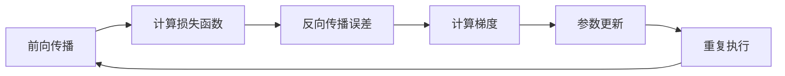
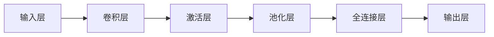

# 深度学习

#人工智能 #深度学习


## 线性神经网络

### 线性回归

线性回归是一种基本的回归模型，用于建立输入变量和输出变量之间的线性关系。它是一种最简单的神经网络模型，只包含一个输入层和一个输出层，其中输入层的每个神经元对应一个输入变量，输出层的一个神经元对应一个输出变量。

线性回归模型的输出是输入变量的线性组合，通过乘以相应的权重并加上偏置项来实现。这可以表示为：

y = w1\*x1 + w2\*x2 + ... + wn\*xn + b

其中，y是输出变量，x1, x2, ..., xn是输入变量，w1, w2, ..., wn是对应的权重，b是偏置项。

在神经网络中，线性回归通常作为神经网络中的一层，其中的权重和偏置项是需要通过训练来学习得到的。通过反向传播算法和优化算法（如梯度下降），可以根据给定的训练数据来调整权重和偏置项，使得模型能够更好地拟合输入和输出之间的线性关系。

线性回归在神经网络中常用于解决回归问题，如预测房价、销售额等连续变量的问题。它的优点是计算简单、易于理解，但对于非线性关系的建模能力有限。在处理非线性问题时，可以通过增加隐藏层和激活函数来构建更复杂的神经网络模型。


### softmax


Softmax函数是一种常用的激活函数，它将一组实数转化为概率分布。在机器学习中，它通常用于多分类问题中，将原始的实数输出转化为每个类别的概率。

Softmax函数的定义如下：
$$
\text{softmax}(z_i) = \frac{e^{z_i}}{\sum_{j=1}^{K} e^{z_j}}
$$
其中，$z_i$是输入向量中的第$i$个元素，$K$是类别的总数。

Softmax函数的特点是它对输入进行归一化，使得所有输出的概率之和为1。它将原始的实数转化为概率，较大的输入会得到较大的输出概率，而较小的输入会得到较小的输出概率。

在深度学习中，Softmax函数通常与交叉熵损失函数结合使用，用于计算模型的预测和真实标签之间的差距。

## 多层感知机


## 反向传播





*利用反向传播计算线性回归*

```python
import numpy as np

# 准备数据
X = np.array([[1], [2], [3], [4], [5]])  # 自变量
y = np.array([2, 4, 6, 8, 10])  # 因变量

# 初始化权重和偏置
w = np.random.randn(1)
b = np.random.randn(1)

# 设置学习率和迭代次数
learning_rate = 0.01
num_iterations = 1000

# 反向传播算法
for i in range(num_iterations):
    # 前向传播
    y_pred = X * w + b
    
    # 计算损失
    loss = np.mean((y_pred - y) ** 2) # 均方误差
    
    # 计算梯度
    dw = np.mean(2 * (y_pred - y) * X) # 将差异乘以 2 是为了简化计算导数的过程
    db = np.mean(2 * (y_pred - y))
    
    # 更新权重和偏置
    w -= learning_rate * dw
    b -= learning_rate * db

# 进行预测
print(w)
print(b)
print("预测结果:", y_pred)

```


## 卷积神经网络

- 图像的平移不变性使我们以相同的方式处理局部图像，而不在乎它的位置。
    
- 局部性意味着计算相应的隐藏表示只需一小部分局部图像像素。
    
- 在图像处理中，卷积层通常比全连接层需要更少的参数，但依旧获得高效用的模型。
    
- 卷积神经网络（CNN）是一类特殊的神经网络，它可以包含多个卷积层。
    
- 多个输入和输出通道使模型在每个空间位置可以获取图像的多方面特征。


### 卷积神经网络基本结构

1. 输入层（Input Layer）：接受原始图像或其他类型的输入数据。

2. 卷积层（Convolutional Layer）：通过应用卷积操作来提取输入图像的特征。每个卷积层都包含多个卷积核（也称为滤波器），每个卷积核在图像上滑动，执行卷积运算以生成特征图。

3. 激活层（Activation Layer）：对卷积层的输出应用非线性激活函数（例如ReLU），以引入非线性特征并增强网络的表达能力。

4. 池化层（Pooling Layer）：通过减少特征图的空间维度来降低计算量，同时保留重要的特征。常见的池化操作包括最大池化和平均池化。

5. 全连接层（Fully Connected Layer）：将前面的层的输出展平并连接到一个全连接层，每个神经元与上一层的所有神经元相连。全连接层用于学习输入特征之间的复杂关系，并生成最终的分类结果。
 
6. 输出层（Output Layer）：根据任务的需求选择适当的激活函数（如softmax）来生成网络的输出，如分类结果或回归预测。




### 常见的神经网络层

1. 输入层：输入层是网络的第一层，用于接收原始数据。
    
2. 卷积层：卷积层是一种特殊的层，用于提取图像的特征。
    
3. 池化层：池化层用于减少数据的维度，压缩数据并保持空间不变性。
    
4. 全连接层：全连接层是一种常见的层，用于将特征层转换为预测的输出。
    
5. 递归层：递归层是一种特殊的层，用于处理序列数据。
    
6. 解码层：解码层是一种特殊的层，用于将编码的特征还原为原始数据。
    
7. 输出层：输出层是网络的最后一层，用于生成预测结果。
    

**这些层仅是神经网络中一些常见的层，并不是全部层。对于不同的问题，还可以使用其他特殊的层，如注意力层，批标准化层等。**

### 全连接层

> - 全连接层（Fully Connected Layer）
> - 特点：全连接层是一种线性的层，其中每个神经元与上一层的所有神经元都有连接。因此，全连接层的每一层都是一个矩阵，其中的每一行代表一个神经元。

> - 作用：全连接层主要用于线性映射，将输入数据从低维空间映射到高维空间。它也可以通过加入非线性激活函数来实现非线性映射。

> - 应用：全连接层通常用于处理回归和分类问题，作为最后一层或接近最后一层，用于预测结果。处理多分类问题，例如图像分类、文本分类等。它还可以用于处理回归问题，例如预测股票价格等。

> - 复杂度：全连接层的复杂度很高，因为每个神经元与上一层的所有神经元都有连接。因此，当网络规模变大时，全连接层的计算量会呈指数增长。

### 二维卷积层

> 二维卷积层（2D Convolutional Layer）
> 
> - 特征提取：二维卷积层通过滑动卷积核对图像进行特征提取。卷积核可以捕捉图像中的局部特征，例如边缘、纹理等。

> - 降维：二维卷积层通过池化操作（如最大池化）降低输入数据的维数，从而减少计算复杂度。

> - 空间不变性：二维卷积层具有空间不变性，意味着它不会因为输入数据的平移而导致输出的变化。

> - 共享权值：二维卷积层的卷积核共享权值，即卷积核在整张图像上的位置可以共享。这有助于减少模型的参数数量，从而防止过拟合。

> - 应用：二维卷积层通常用于处理图像分类、语音识别等问题。它可以从输入图像中捕捉高层抽象的特征，并将其作为后续层的输入。

### 池化层

> 池化层（Pooling Layer）

> - 压缩数据：池化层通过压缩数据来减小模型的参数数量，降低计算复杂度。

> - 减少特征数：池化层可以减少前一层的特征数，降低模型的复杂度。

> - 空间不变性：池化层保留了图像的空间不变性，即它们具有平移不变性。

> - 提高特征的通用性：池化层可以通过下采样来提高特征的通用性，从而对图像的小变化具有更强的鲁棒性。

> - 应用：池化层通常与卷积层结合使用，用于在卷积层之后压缩数据并保持空间不变性。

### 循环层

> 循环层(Recurrent Neural Network, RNN)
> 
> - 处理序列数据：循环层专门用于处理序列数据，例如文本，语音，时间序列等。

> - 具有记忆能力：循环层通过状态向量记录上一次的状态，并将其传递到下一次的循环中。

> - 长时依赖：循环层允许模型在长时间内记住信息，这对于处理长时间序列数据是非常有用的。

> - 支持变长输入：循环层能够处理变长输入，而不需要将它们转换为固定长度的张量。

> - 灵活性：循环层可以通过改变循环单元的结构来实现不同的功能，例如长短时记忆网络（LSTM）和门控循环单元（GRU）等。

### 递归层

> 递归层(Recursive Neural Network, RNN)
> 
> - 输入：递归层的输入可以是一个序列，例如一段文本、一组时间序列数据等。

> - 循环：递归层在每个时间步执行相同的计算操作，并通过上一个时间步的结果影响当前时间步的结果，实现循环。

> - 隐藏状态：递归层维护一个隐藏状态，以存储上一个时间步的信息，并将其作为当前时间步的输入。

> - 相邻时间步的关联：递归层通过隐藏状态，实现了相邻时间步之间的关联，从而可以捕捉序列数据中的长期依赖关系。

> - 递归层的特点使其适合处理序列数据，例如文本分类、语音识别、时间序列预测等任务。

### 解码层

> 解码层，也称为输出层，是神经网络的最后一层

> - 输出结果：解码层用于输出最终的模型结果。

> - 活跃函数：解码层常常使用激活函数，例如softmax函数，来进行归一化处理，以便输出的每个结果的概率都在0和1之间。

> - 目标函数：解码层的结果通常作为目标函数的输入，并与实际输出进行比较，以评估模型的性能。

> - 多类别分类：解码层通常用于多类别分类问题，例如图像分类，文本分类等。

> - 解码技术：解码层的结构和技术可以大大影响模型的性能，例如使用不同的目标函数，采用不同的解码算法等。

### 输出层

> - 作用：输出神经网络的预测结果。

> - 输出类型：输出结果可以是离散值（例如分类问题）或连续值（例如回归问题）。

> - 激活函数：根据问题的性质，输出层可以使用Sigmoid、Softmax、线性等激活函数。

> - 输出维度：输出结果的维度取决于问题的数量，例如对于分类问题，输出结果的维度是类别数量，而对于回归问题，输出结果的维度是预测的值的数量。

### 循环层和递归层的区别

> - 循环层：循环层是指在神经网络中使用循环结构，重复执行相同的操作，适用于处理具有循环性质的问题。

> - 递归层：递归层是指在神经网络中使用递归结构，通过递归调用自身函数，适用于处理具有递归性质的问题。

> - 处理对象：循环层通常处理的是序列数据，如文本，时间序列等；递归层通常处理的是树形结构，如语法树，决策树等。

> - 操作方式：循环层通常在时间上循环处理；递归层通常在空间上递归处理。

> - 实现方式：循环层常常使用循环语句，如for循环，while循环等；递归层常常使用递归函数，如递归下降法等。

  
[神经网络各层的特点 - 掘金](https://juejin.cn/post/7196330013981392933)


### 1 \* 1 卷积层的作用


### 卷积神经网络相关计算

### 卷积层

- 卷积核的channel与特征卷积层的channel相同
- 输出的特征矩阵channel与卷积核个数相同

***

经过卷积后的矩阵尺寸大小计算公式为：

$$
N = (W-F+2P)/S + 1
$$
1. 输入图片的大小 $W \times W$
2. Filter大小 $F \times F$
3. 步长 $S$
4. padding的像素数 $P$

输出尺寸 = (输入尺寸 - 卷积核尺寸 + 2 * 填充大小) / 步长 + 1


**sigmoid激活函数**

作用是引入非线性变换，增加神经网络的表达能力。

$$
f(x) = \frac{1}{1+e^{-x}}
$$
网络层数较深时，易出现梯度消失


**Relu激活函数**

$$
f(x) = Max(0,x)
$$

1. **Dying ReLU问题**：当神经元的输入值为负数时，ReLU 函数的输出为零，导致神经元失活。在训练过程中，如果一旦某个神经元的权重被更新到使其输出为负数，那么该神经元在后续的训练过程中将不再激活，导致该神经元永远不会学习。这种情况称为 "Dying ReLU"，影响了网络的表达能力。
    
2. **输出不是零中心**：ReLU 的输出范围在正半轴，即 [0, +∞)，因此其均值不为零。这导致了一些问题，比如在网络层叠加时，可能会导致梯度爆炸或消失。
    
3. **不适合处理负数输入**：ReLU 在输入为负数时输出为零，这可能不适合某些情况。比如在某些回归任务中，输出需要包含负数值，但 ReLU 函数无法直接处理这些情况。
    
4. **导致梯度消失**：虽然 ReLU 可以解决梯度消失问题，但它仍然可能导致梯度消失。在训练过程中，某些神经元可能会永远保持非活跃状态，导致它们的权重始终不会被更新，从而造成梯度消失问题。
    
5. **不是平滑函数**：ReLU 在零点处不可导，这在某些优化算法中可能会导致问题


### 以上的内容需要整理


## 归一化

[归一化基础知识点 — PaddleEdu documentation](https://paddlepedia.readthedocs.io/en/latest/tutorials/deep_learning/normalization/basic_normalization.html)

归一化的目的就是使得预处理的数据被限定在一定的范围内，比如\[0,1\]或者\[-1,1\]，消除奇异样本数据导致的不良影响

比如，下面的x6就是奇异数据

| x1  | x2  | x3  | x4  | x5  | x6  |
| --- | --- | --- | --- | --- | --- |
| 1.1 | 1.6 | 1.3 | 1.5 | 1.2 | 6.6    |


如果不进行归一化，那么由于特征向量中不同特征的取值相差较大，梯度容易偏离最小值的方向


归一化的好处：

1. 加快梯度下降求最优解的速度（加快训练网络的收敛性）
2. 归一化有可能提高精度


常用的归一化方法包括：

1. 最小-最大归一化（MinMax normalization）：将数据缩放到指定的最小值和最大值之间。公式为：
$$
X_{normalized} = (X - X_{min}) / (X_{max} - X_{min})
$$

2. Z-Score标准化（Z-Score normalization）：将数据转化为均值为0，标准差为1的正态分布。公式为：
$$
X_{normalized} = (X - X_{mean}) / X_{std}
$$

3. 小数定标标准化（Decimal scaling normalization）：将数据除以某个数的幂，使其落在\[-1,1\]或\[0,1\]之间。公式为：
$$
X_{normalized} = X / 10^d
$$

其中d为使得最大绝对值小于1的数的幂次数。

**批量归一化层：**

- 可学习的参数为$\gamma$和$\beta$
- 作用在
    - 全连接层和卷积层输出上，激活函数前
    - 全连接层和卷积层输入上
- 对全连接层，作用在特征维
- 对于卷积层，作用在通道维

使用要求，数据量足够大


在批量归一化（Batch Normalization）中，给定一批样本：$x^{(1)}, x^{(2)}, ..., x^{(m)}$，归一化的公式如下：

$$
\hat{x}^{(i)} = \frac{x^{(i)} - \mu}{\sqrt{\sigma^2 + \epsilon}}
$$

其中，$\mu$表示整个批次样本的均值，$\sigma^2$表示整个批次样本的方差，$\epsilon$是一个很小的数，用来避免分母为零。归一化完成之后，再使用缩放因子$\gamma$和偏移量$\beta$对归一化的结果进行还原：

$$
y^{(i)} = \gamma \hat{x}^{(i)} + \beta
$$

其中，$\gamma$和$\beta$是可以学习的参数。


*没必要和dropout混合使用*

- 批量归一化固定小批量中的均值和方差，然后学习出适合的偏移和缩放
- 可以加速收敛速度，但一般不改变模型精度

## 残差神经网络 ResNet


