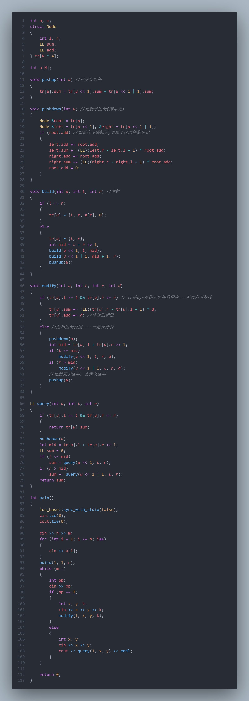

# Tricks
1. 1~n,随机打乱,最快使这些数回到对应i的位置

	2、3、5、1、4
	
	1、2、3、4、5

```cpp
for (int i = 1;i<=n;i++)
{
    while(a[a[i]]!=a[i])
        swap(a[a[i]], a[i]);
}
```

2. 数字转字符串

```cpp
string s;
s = to_string(int);
s = to_string(long long);
```

3. 字符串转数字

```cpp
string s = "124"
int a = stoi(s);
long long b = stol(s);
float c = stof(s);
```
***

# 字符串

## KMP

***
# 邻接表

```cpp
// head存储链表头，e[]存储节点的值，ne[]存储节点的next指针，idx表示当前用到了哪个节点
int head, e[N], ne[N], idx;

// 初始化
void init()
{
    head = -1;
    idx = 0;
}

// 在链表头插入一个数a
void insert(int a)
{
    e[idx] = a, ne[idx] = head, head = idx ++ ;
}
// 在链表头a插入一个数b
void add(int a,int b)
{
    e[idx] = b, ne[idx] = head[a], head[a] = idx ++ ;
}

// 将头结点删除，需要保证头结点存在
void remove()
{
    head = ne[head];
}
/*
head <- e[0] <- e[1] <- e[2] 
head == idx == 2
*/ 
```

遍历链表a

```cpp
for (int i = h[a]; i != -1; i = ne[i])
{
	j = e[i];
}
```


## 单调队列


```cpp
//   https://www.acwing.com/problem/content/description/156/

#include <iostream>
using namespace std;
const int N = 1e6 + 10;
int n, k, q[N], a[N]; // q[N]存的是数组下标
int main()
{
    int tt = -1, hh = 0; // hh队列头 tt队列尾
    cin.tie(0);
    ios::sync_with_stdio(false);
    cin >> n >> k;
    for (int i = 0; i < n; i++)
        cin >> a[i];
    // 最大值
    for (int i = 0; i < n; i++)
    {
        // 维持滑动窗口的大小
        // 当队列不为空(hh <= tt) 且 当前滑动窗口的大小(i - q[hh] + 1) 大于 我们设定的滑动窗口的大小(k),
        // 队列弹出队列头元素以维持滑动窗口的大小
        if (hh <= tt && k < i - q[hh] + 1)
            hh++;
        // 构造单调递增队列
        // 当队列不为空(hh <= tt) 且 队列队尾元素>=当前元素(a[i])时,那么队尾元素就一定不是当前窗口最小值,
        // 删去队尾元素,加入当前元素(q[ ++ tt] = i)
        while (hh <= tt && a[q[tt]] >= a[i])
            tt--;
        q[++tt] = i;
        if (i + 1 >= k)
            cout << a[q[hh]] << " ";
    }
    cout << "\n";

    // 最小值
    hh = 0, tt = -1;
    for (int i = 0; i < n; i++)
    {
        if (hh <= tt && k < i - q[hh] + 1)
            hh++;
        while (hh <= tt && a[q[tt]] <= a[i])
            tt--;
        q[++tt] = i;
        if (i + 1 >= k)
            cout << a[q[hh]] << " ";
    }
    return 0;
}

```


# 图论

## 求最短路径

最短路算法之间的比较

| **最短路算法**       | Floyd                | Bellman-Ford | Dijkstra   | Johnson              |
| :-------------------- | :-------------------- | :------------ | :---------- | :-------------------- |
| **最短路类型**       | 每对结点之间的最短路 | 单源最短路   | 单源最短路 | 每对结点之间的最短路 |
| **作用于**           | 任意图               | 任意图       | 非负权图   | 任意图               |
| **能否检测负环？**   | 能                   | 能           | 不能       | 能                   |
| **推荐作用图的大小** | 小                   | 中/小        | 大/中      | 大/中                |
| **时间复杂度**       | $O(n^3)$             | $O(NM)$      | $O(MlogM)$ | $O(NMlogM)$          |

### Floyd
>[!todo]

### SPFA

```cpp
struct edge {
  int v, w;
};

vector<edge> e[maxn];
int dis[maxn], cnt[maxn], vis[maxn];
queue<int> q;

bool spfa(int n, int s) {
  memset(dis, 63, sizeof(dis));
  dis[s] = 0, vis[s] = 1;
  q.push(s);
  while (!q.empty()) {
    int u = q.front();
    q.pop(), vis[u] = 0;
    for (auto ed : e[u]) {
      int v = ed.v, w = ed.w;
      if (dis[v] > dis[u] + w) {
        dis[v] = dis[u] + w;
        cnt[v] = cnt[u] + 1;  // 记录最短路经过的边数
        if (cnt[v] >= n) return false;
        // 在不经过负环的情况下，最短路至多经过 n - 1 条边
        // 因此如果经过了多于 n 条边，一定说明经过了负环
        if (!vis[v]) q.push(v), vis[v] = 1;
      }
    }
  }
  return true;
}

```

### 朴素Dijkstra求最短路

```cpp
#include <iostream>
#include <algorithm>
#include <cstring>
using namespace std;

const int N = 510;

int n, m;
int g[N][N]; //存储每条边
int dist[N]; //存储1号点到每个点的最短距离
bool st[N];  //存储每个点的最短路是否已经确定

// 求1号点到n号点的最短路，如果不存在则返回-1
int dijkstra()
{
    memset(dist, 0x3f3f3f3f, sizeof(dist));
    dist[1] = 0;
    for (int i = 0; i < n; i++)
    {
        int t = -1;
        //在还未确定最短路的点中，寻找距离最小的点
        for (int j = 1; j <= n; j++)
        {
            if (!st[j] /*不在st中的点*/ && (t == -1 || dist[t] > dist[j]))
            {
                t = j;
            }
        }
        st[t] = true;

        // 用t更新其他点的距离
        for (int j = 1; j <= n; j++)
        {
            dist[j] = min(dist[j], dist[t] + g[t][j]);
        }
    }
    if (dist[n] == 0x3f3f3f3f)
        return -1;
    return dist[n];
}

int main()
{
    scanf("%d%d", &n, &m);
    memset(g, 0x3f3f3f3f, sizeof(g));
    while (m--)
    {
        int a, b, c;
        scanf("%d%d%d", &a, &b, &c);
        g[a][b] = min(g[a][b], c);
    }
    int t = dijkstra();
    printf("%d\n", t);
    return 0;
}
```

### 堆优化Dijkstra求最短路

```cpp
// Dijkstra堆优化
#include <cstring>
#include <iostream>
#include <algorithm>
#include <queue>
using namespace std;
typedef pair<int, int> PII;
const int N = 1e6 + 10;

int n, m;
int h[N], w[N], e[N], ne[N], idx;
int dist[N];
bool st[N];
void add(int a, int b, int c)
{
    e[idx] = b, w[idx] = c, ne[idx] = h[a], h[a] = idx++;
}
  
int dijkstra()
{
    memset(dist, 0x3f3f3f3f, sizeof(dist));
    memset(st, 0, sizeof(st));
    dist[1] = 0;
    priority_queue<PII, vector<PII>, greater<PII>> heap;
    heap.push({0, 1});
    while (heap.size())
    {
        auto t = heap.top();
        heap.pop();
        int ver = t.second, distance = t.first;

        if (st[ver])
            continue;
            
        st[ver] = true;
        for (int i = h[ver]; i != -1; i = ne[i])
        {
            int j = e[i];
            if (dist[j] > dist[ver] + w[i])
            {
                dist[j] = dist[ver] + w[i];
                heap.push({dist[j], j});
            }
        }
    }
    if (dist[n] == 0x3f3f3f3f)
        return -1;
    return dist[n];
}
  
int main()
{
    scanf("%d%d", &n, &m);
    memset(h, -1, sizeof h);
    while (m--)
    {
        int a, b, c;
        scanf("%d%d%d", &a, &b, &c);
        add(a, b, c);
    }
    cout << dijkstra() << endl;
    return 0;

}
```


## 最小生成树

### Kruskal算法

``` cpp
//Kruskal算法求最小生成树
#include<iostream>
#include<algorithm>
#include<cstring>
using namespace std;

const int N=10010,M=3*N;


int n,m;//n是点数，m是边数
int p[N];//并查集的父节点数组

struct edge     //储存边
{
    int a,b,w;
    bool operator< (const edge &W)const
    {
        return w < W.w;
    }
}e[M];

int find(int x) //并查集操作
{
    if(p[x]!=x)
    p[x]=find(p[x]);
    return p[x];
}

int kur()
{
    int r=0;
    int cnt=0;      //记录边数
    int i;
    for(i=0;i<m;i++)
    {
        int a=e[i].a,b=e[i].b,w=e[i].w;
        a=find(a);
        b=find(b);
        if(a!=b)    //如果这两个连通块不联通，则将这两个联通块合并，添加边
        {
            p[a]=b;
            r=+w;
            cnt++;
        }
    }
    if(cnt<n-1)
    return -1;
    else
    return r;
}

int main()
{
    scanf("%d%d",&n,&m);
    int i,j,k;
    for(i=1;i<=n;i++)
    {
        p[i]=i;
    }

    for(i=0;i<m;i++)
    {
        int a,b,w;
        scanf("%d%d%d",&a,&b,&w);
        e[i]={a,b,w};
    }

    sort(e,e+m);

    printf("%d",kur());
    return 0;
}
```

### 次小生成树


```
//Todo:
```


## SPFA求负环

SPFA模板: [Algorithm/spfa算法.cpp at main · PiakoCode/Algorithm (github.com)](https://github.com/PiakoCode/Algorithm/blob/main/%E5%9B%BE%E8%AE%BA/spfa%E7%AE%97%E6%B3%95.cpp)

```
//Todo:
```


## LCA(最近公共祖先)

### 倍增法

[1172. 祖孙询问 - AcWing题库](https://www.acwing.com/problem/content/description/1174/)

```cpp
#include <cstdio>
#include <cstring>
#include <iostream>
#include <algorithm>

using namespace std;

const int N = 40010, M = N * 2;

int n, m;
int h[N], e[M], ne[M], idx;
int depth[N], fa[N][16];
int q[N];

void add(int a, int b)
{
    e[idx] = b, ne[idx] = h[a], h[a] = idx ++ ;
}

void bfs(int root)
{
    memset(depth, 0x3f, sizeof depth);
    depth[0] = 0, depth[root] = 1;
    int hh = 0, tt = 0;
    q[0] = root;
    while (hh <= tt)
    {
        int t = q[hh ++ ];
        for (int i = h[t]; ~i; i = ne[i])
        {
            int j = e[i];
            if (depth[j] > depth[t] + 1)
            {
                depth[j] = depth[t] + 1;
                q[ ++ tt] = j;
                fa[j][0] = t;
                for (int k = 1; k <= 15; k ++ )
                    fa[j][k] = fa[fa[j][k - 1]][k - 1];
            }
        }
    }
}

int lca(int a, int b)
{
    if (depth[a] < depth[b]) swap(a, b);
    for (int k = 15; k >= 0; k -- )
        if (depth[fa[a][k]] >= depth[b])
            a = fa[a][k];
    if (a == b) return a;
    for (int k = 15; k >= 0; k -- )
        if (fa[a][k] != fa[b][k])
        {
            a = fa[a][k];
            b = fa[b][k];
        }
    return fa[a][0];
}

int main()
{
    scanf("%d", &n);
    int root = 0;
    memset(h, -1, sizeof h);

    for (int i = 0; i < n; i ++ )
    {
        int a, b;
        scanf("%d%d", &a, &b);
        if (b == -1) root = a;
        else add(a, b), add(b, a);
    }

    bfs(root);

    scanf("%d", &m);
    while (m -- )
    {
        int a, b;
        scanf("%d%d", &a, &b);
        int p = lca(a, b);
        if (p == a) puts("1");
        else if (p == b) puts("2");
        else puts("0");
    }

    return 0;
}
```

### Tarjan算法

[1171. 距离 - AcWing题库](https://www.acwing.com/problem/content/description/1173/)

```cpp
#include <cstdio>
#include <cstring>
#include <iostream>
#include <algorithm>
#include <vector>

using namespace std;

typedef pair<int, int> PII;

const int N = 10010, M = N * 2;

int n, m;
int h[N], e[M], w[M], ne[M], idx;
int dist[N];
int p[N];
int res[M];
int st[N];
vector<PII> query[N];   // first存查询的另外一个点，second存查询编号

void add(int a, int b, int c)
{
    e[idx] = b, w[idx] = c, ne[idx] = h[a], h[a] = idx ++ ;
}

void dfs(int u, int fa)
{
    for (int i = h[u]; ~i; i = ne[i])
    {
        int j = e[i];
        if (j == fa) continue;
        dist[j] = dist[u] + w[i];
        dfs(j, u);
    }
}

int find(int x)
{
    if (p[x] != x) p[x] = find(p[x]);
    return p[x];
}

void tarjan(int u)
{
    st[u] = 1;
    for (int i = h[u]; ~i; i = ne[i])
    {
        int j = e[i];
        if (!st[j])
        {
            tarjan(j);
            p[j] = u;
        }
    }

    for (auto item : query[u])
    {
        int y = item.first, id = item.second;
        if (st[y] == 2)
        {
            int anc = find(y);
            res[id] = dist[u] + dist[y] - dist[anc] * 2;
        }
    }

    st[u] = 2;
}

int main()
{
    scanf("%d%d", &n, &m);
    memset(h, -1, sizeof h);
    for (int i = 0; i < n - 1; i ++ )
    {
        int a, b, c;
        scanf("%d%d%d", &a, &b, &c);
        add(a, b, c), add(b, a, c);
    }

    for (int i = 0; i < m; i ++ )
    {
        int a, b;
        scanf("%d%d", &a, &b);
        if (a != b)
        {
            query[a].push_back({b, i});
            query[b].push_back({a, i});
        }
    }

    for (int i = 1; i <= n; i ++ ) p[i] = i;

    dfs(1, -1);
    tarjan(1);

    for (int i = 0; i < m; i ++ ) printf("%d\n", res[i]);

    return 0;
}

```

### SCC(强连通分量)

*Tarjan*算法


[1174. 受欢迎的牛 - AcWing题库](https://www.acwing.com/problem/content/description/1176/)

```cpp
#include <cstdio>
#include <cstring>
#include <iostream>
#include <algorithm>

using namespace std;

const int N = 10010, M = 50010;

int n, m;
int h[N], e[M], ne[M], idx;
int dfn[N], low[N], timestamp;
int stk[N], top;
bool in_stk[N];
int id[N], scc_cnt, Size[N];//每个强连通分的节点个数
int dout[N];

void add(int a, int b)
{
    e[idx] = b;
    ne[idx] = h[a];
    h[a] = idx ++;
}

void tarjan(int u)
{
    //u的时间戳
    dfn[u] = low[u] = ++timestamp;
    //把当前点加到栈中  当前点在栈中
    stk[++top] = u,in_stk[u] = true;

    for(int i=h[u];i!=-1;i=ne[i])
    {
        int j=e[i];
        if(!dfn[j])//j点未被遍历过
        {
            tarjan(j);//继续dfs 遍历j
            //j也许存在反向边到达比u还高的层,所以用j能到的最小dfn序(最高点)更新u能达到的(最小dfn序)最高点
            low[u] = min(low[u],low[j]);
        }
        //j点在栈中  说明还没出栈 是dfs序比当前点u小的
        //则其 1要么是横插边(左边分支的点)
        //         o
        //        / \
        //       j ← u    
        //     2要么是u的祖宗节点
        //         j
        //       ↗/ 
        //       u    
        //    两种情况u的dfs序都比j大 所以用dfn[j]更新low[u]
        else if(in_stk[j])
        {
            low[u] = min(low[u],dfn[j]);//直接用j的时间戳更新u
        }
        //栈代表当前未被搜完的强连通分量的所有点
    }
    // ⭐
    // 解释一下为什么tarjan完是逆dfs序
    // 假设这里是最高的根节点fa
    // 上面几行中 fa的儿子节点j都已经在它们的递归中走完了下面9行代码
    // 其中就包括 ++scc_cnt 
    // 即递归回溯到高层节点的时候 子节点的scc都求完了
    // 节点越高 scc_id越大
    // 在我们后面想求链路dp的时候又得从更高层往下
    // 所以得for(int i=scc_cnt(根节点所在的scc);i;i--)开始

    // 所以当遍历完u的所有能到的点后 发现u最高能到的点是自己
    // 1 则u为强连通分量中的最高点,则以u为起点往下把该强连通分量所有节点都找出来
    // 2 要么它就没有环,就是一个正常的往下的点
    if(dfn[u]==low[u])
    {
        int y;
        ++scc_cnt;//强连通分量总数+1
        do
        {
            y = stk[top--];//取栈顶元素y
            in_stk[y] = false;//则y不再在栈中
            id[y] = scc_cnt;
            Size[scc_cnt] ++;//第scc_cnt个连通块点数+1
        }while(y!=u);
        //1 因为栈中越高的元素的dfs序越大,那么我们只需要把dfs序比u大的这些pop到u
        //即因为最终会从下至上回到u 所以当y==u     
        //则说明点u所在的所有强连通分量都标记了id
        //           →  u
        //          /  /
        //         /  ne1
        //         ← ne2
        //      因为ne2会在u能到的dfs序里最大的,也就是此时的栈顶
        //      那么我们就逐一pop出ne2和ne1
        //2 要么它就是一个没有环的点 则该点单点成一个连通分量
    }
}

int main()
{
    cin >> n >> m;
    memset(h,-1,sizeof h);
    while(m--)
    {
        int a,b;
        cin >> a >> b;
        add(a,b);
    }

    for (int i = 1; i <= n; i ++ )
        if (!dfn[i])
            tarjan(i);
    //统计新图中点的出度 
    for (int i = 1;i <= n; i ++ )
        for (int j = h[i];j!=-1; j = ne[j])
        {
            int k = e[j];
            int a = id[i], b = id[k];//a,b不为一个连通分量
            if (a != b) dout[a] ++ ;//a出度+1  dout[a] += i→k
        }
    int zeros = 0, sum = 0;//sum 存的所有出度为0的强连通分量的点的数量
    for (int i = 1; i <= scc_cnt; i ++ )
        if (!dout[i])//如果第i个强连通分量出度==0
        {
            zeros ++ ;
            sum += Size[i];//则加上第i个强连通分量的点的个数
            if (zeros > 1)//如果有k>1个出度为0的 则会存在k-1头牛不被所有牛欢迎
            {
                sum = 0;
                break;
            }
        }

    cout << sum;
    return 0;
}
```

***

# 数学

## 质数筛

```cpp
//欧拉筛法，时间复杂度:O(n)
#include<iostream>
using namespace std;
const int MAXN = 1000010;
int p[MAXN];
int v[MAXN];
int cnt = 0;
// C++ Version
void init() {
  for (int i = 2; i < MAXN; ++i) {
    if (!v[i]) {
      p[cnt++] = i;
    }
    for (int j = 0; j < cnt; ++j) {
      if (1ll * i * p[j] >= MAXN) break;
      v[i * p[j]] = 1;
      if (i % p[j] == 0) {
        // i % p[j] == 0
        // 换言之，i 之前被 p[j] 筛过了
        // 由于 p 里面质数是从小到大的，所以 i 乘上其他的质数的结果一定也是
        // p[j] 的倍数 它们都被筛过了，就不需要再筛了，所以这里直接 break
        // 掉就好了
        break;
      }
    }
  }
}

int main()
{
  for (int i = 0; i < 100;i++)
  {
    cout << p[i] << endl;
  }
    return 0;
}
```

## 快速幂

求$a^n$

```cpp
//递归式,时间复杂度:O(log n )
long long binpow(long long a, long long b) {
  if (b == 0) return 1;
  long long res = binpow(a, b / 2);
  if (b % 2)
    return res * res * a;
  else
    return res * res;
}
```

```cpp
//非递归式
long long binpow(long long a, long long b)
{
    long long res = 1;
    while (b > 0)
    {
        if (b & 1)
            res = res * a;
        a = a * a;
        b >>= 1;
    }
    return res;
}
```

## 位运算


### 取最大值、最小值

```cpp
// 如果 a>=b,(a-b)>>31 为 0，否则为 -1 
int max(int a, int b) { return b & ((a - b) >> 31) | a & (~(a - b) >> 31); } 
int min(int a, int b) { return a & ((a - b) >> 31) | b & (~(a - b) >> 31); }
```

### 判断两非零数符号是否相同

```cpp
bool isSameSign(int x, int y) 
{ // 有 0 的情况例外 
	return (x ^ y) >= 0; 
}
```

### 操作一个数的二进制位


### 模拟集合操作

==主要用于状态压缩==


## 最大公约数

#### 拓展欧几里得算法

常用于求$ax+by=gcd(a,b)$的一组可行解


实现:

```cpp
// 递归法
int Exgcd(int a, int b, int &x, int &y)
{
    if (!b)
    {
        x = 1;
        y = 0;
        return a;
    }
    int d = Exgcd(b, a % b, x, y);
    int t = x;
    x = y;
    y = t - (a / b) * y;
    return d;
}
```
```cpp
// 迭代法
int Exgcd(int a, int b, int &x, int &y)
{
    x = 1, y = 0;
    int x1 = 0, y1 = 1, a1 = a, b1 = b;
    while (b1)
    {
        int q = a1 / b1;
        tie(x, x1) = make_tuple(x1, x - q * x1);
        tie(y, y1) = make_tuple(y1, y - q * y1);
        tie(a1, b1) = make_tuple(b1, a1 - q * b1);
    }
    return a1;
}
```
***

# 动态规划

[动态规划](动态规划.md)

__DP分析法__

1. 状态表示
   - 集合
   - 属性
2. 状态计算(集合划分)

状态转移方程


## 0-1背包问题

```cpp
//优化后
#include<iostream>
#include<algorithm>
using namespace std;

const int N=1010;
int n,m;
int f[N];
int v[N],w[N];

int main()
{
    cin>>n>>m;
    int i,j;
    for(i=1;i<=n;i++)
    {
        cin>>v[i]>>w[i];
    }

    for(i=1;i<=n;i++)
    {
        for(j=m;j>=v[i];j--)
        {
                f[j]=max(f[j],f[j-v[i]]+w[i]);
                //f[j]-不放入入物品
                //f[j-v[i]]+w[i]-放入物品
                //j-剩余的容量
                //j-v[i]放入第i个物品后剩余的容量
        }
    }
    int res=0;
    for(i=1;i<=m;i++)
    {
        res=max(res,f[i]);
    }
    cout<<res<<endl;
    return 0;
}
```

## 完全背包问题

```cpp
//未优化
#include<iostream>
using namespace std;

const int N=1010;
int n,m;
int f[N][N];
int v[N],w[N];

int main()
{
    cin>>n>>m;
    int i,j,k;
    for(i=1;i<=n;i++)
    {
        cin>>v[i]>>w[i];
    }
    for(i=1;i<=n;i++)
    {
        for(j=0;j<=m;j++)
        {
            for(k=0;k*v[i]<=j;k++)
            {
                f[i][j]=max(f[i][j],f[i-1][j-v[i]*k]+w[i]*k);
            }
        }
    }
    cout<<f[n][m];
    return 0;
}
```

```cpp
//优化后
#include<iostream>
#include<algorithm>
using namespace std;

const int N=1010;
int n,m;
int v[N],w[N];
int f[N];

int main()
{
    cin>>n>>m;
    int i,j,k;
    for(i=1;i<=n;i++)
    {
        cin>>v[i]>>w[i];
    }
    for (i = 1; i <= n; i++)
    {
        for (j = v[i]; j <= m; j++)
        {
            f[j] = max(f[j], f[j - v[i]] + w[i]);
        }
    }
    cout<<f[m];
    return 0;
}
```

## 线性DP

[**数字三角形**](https://www.luogu.com.cn/problem/P1216)

```cpp
#include <iostream>
#include <algorithm>
using namespace std;

const int N = 1010;
const int INF = 1e9;
int f[N][N];
int a[N][N];
int main()
{
    int r;
    int i, j, k;
    cin >> r;
    int t = -10e9;
    for (i = 1; i <= r; i++)
    {
        for (j = 1; j <= i; j++)
        {
            cin >> a[i][j];
        }
    }
    for (i = 0; i <= r; i++)
    {
        for (j = 0; j <= i + 1; j++)
        {
            f[i][j] = -INF;
        }
    }
    f[1][1] = a[1][1];
    for (i = 2; i <= r; i++)
    {
        for (j = 1; j <= i; j++)
        {
            f[i][j] = max(f[i - 1][j - 1] + a[i][j], f[i - 1][j] + a[i][j]);
        }
    }
    for (i = 1; i <= r; i++)
    {
        t = max(t, f[r][i]);
    }
    cout << t << endl;
    return 0;
}
```

[895. 最长上升子序列 - AcWing题库](https://www.acwing.com/problem/content/897/)

```cpp
#include<iostream>
using namespace std;
const int N = 10010;
int f[N];
int a[N];
int main()
{
    int n;
    cin>>n;
    int i,j,k;
    for (i = 1; i <=n;i++)
    {
        cin >> a[i];
    }
    for (i = 1; i <= n;i++)
    {
        f[i] = 1;
        for (j = 1; j < i;j++)
        {
            if(a[j]<a[i])
                f[i] = max(f[i], f[j] + 1);
        }
    }
    int res=0;
    for (i = 0; i <= n;i++)
    {
        res = max(res, f[i]);
    }
    cout << res << endl;
    return 0;
}
```

[897. 最长公共子序列 - AcWing题](https://www.acwing.com/problem/content/899/)

```cpp
#include <iostream>
#include <algorithm>
using namespace std;
const int N = 100010;

char a[N];
char b[N];
int f[1010][1010];

int main()
{
    int n, m;
    cin >> n >> m;
    int i, j, k;
    for (i = 1; i <= n; i++)
        cin >> a[i];
    for (i = 1; i <= m; i++)
        cin >> b[i];
    for (i = 1; i <= n; i++)
        for (j = 1; j <= m; j++)
        {
            f[i][j] = max(f[i - 1][j], f[i][j - 1]);
            if (a[i] == b[j])
                f[i][j] = max(f[i - 1][j - 1] + 1, f[i][j]);
        }
    cout << f[n][m] << endl;
    return 0;
}
```

***

# 高级数据结构

## 树状数组
!(五分钟丝滑动画讲解 | 树状数组)[https://www.bilibili.com/video/BV1ce411u7qP]


```cpp
int b[N];

inline int lowbit(int x)
{
    return x & (-x);
}

void add(int p, int x) // 单点修改 || 初始化
{
    while (p < N)
    {
        b[p] += x;
        p += lowbit(p);
    }
}

LL getSum(int p) // a[1]...a[p]的和
{
    LL result = 0;
    while (p)
    {
        result += b[p];
        p -= lowbit(p);
    }
    return result;
}
```

## 线段树
**无lazy标记**
```cpp
void pushup(int u) // 由子节点的信息，来计算父节点的信息
{
    tr[u].v = max(tr[u << 1].v, tr[u << 1 | 1].v);
}
  
void build(int u, int l, int r)
{
    tr[u] = {l, r};
    if (l == r)
        return;
    int mid = l + r >> 1;
    build(u << 1, l, mid), build(u << 1 | 1, mid + 1, r);
}

int query(int u, int l, int r)
{
    if (tr[u].l >= l && tr[u].r <= r)
        return tr[u].v; // 树中节点，已经被完全包含在[l, r]中了
  
    int mid = tr[u].l + tr[u].r >> 1;
    int v = 0;
    if (l <= mid)
        v = query(u << 1, l, r);
    if (r > mid)
        v = max(v, query(u << 1 | 1, l, r));

   return v;
}

void modify(int u, int x, int v)
{
    if (tr[u].l == x && tr[u].r == x)
        tr[u].v = v;
    else
    {
        int mid = tr[u].l + tr[u].r >> 1;
        if (x <= mid)
            modify(u << 1, x, v);
        else
            modify(u << 1 | 1, x, v);
        pushup(u);
    }
}
```
**有lazy标记**
```cpp
int n, m;
int w[N];

struct Node
{
    int l, r;
    LL sum, add;
} tr[N * 4];
  

void pushup(int u)
{
    tr[u].sum = tr[u << 1].sum + tr[u << 1 | 1].sum;
}
  

void pushdown(int u)
{
    auto &root = tr[u], &left = tr[u << 1], &right = tr[u << 1 | 1];
    if (root.add)
    {
        left.add += root.add, left.sum += (LL)(left.r - left.l + 1) * root.add;
        right.add += root.add, right.sum += (LL)(right.r - right.l + 1) * root.add;
        root.add = 0;
    }
}
void build(int u, int l, int r)
{
    if (l == r)
        tr[u] = {l, r, w[r], 0};
    else
    {
        tr[u] = {l, r};
        int mid = l + r >> 1;
        build(u << 1, l, mid), build(u << 1 | 1, mid + 1, r);
        pushup(u);
    }
}
void modify(int u, int l, int r, int d)
{
    if (tr[u].l >= l && tr[u].r <= r)
    {
        tr[u].sum += (LL)(tr[u].r - tr[u].l + 1) * d;
        tr[u].add += d;
    }
    else // 一定要分裂
    {
        pushdown(u);
        int mid = tr[u].l + tr[u].r >> 1;
        if (l <= mid)
            modify(u << 1, l, r, d);
        if (r > mid)
            modify(u << 1 | 1, l, r, d);
        pushup(u);
    }
}
LL query(int u, int l, int r)
{
    if (tr[u].l >= l && tr[u].r <= r)
        return tr[u].sum;
  
    pushdown(u);
    int mid = tr[u].l + tr[u].r >> 1;
    LL sum = 0;
    if (l <= mid)
        sum = query(u << 1, l, r);
    if (r > mid)
        sum += query(u << 1 | 1, l, r);
    return sum;
}
```
[P3372 【模板】线段树 1 - 洛谷](https://www.luogu.com.cn/problem/P3372)


## 字典树(Trie)

[字典树 (Trie)-OI Wiki](https://oi-wiki.org/string/trie/)


[142. 前缀统计 - AcWing题库](https://www.acwing.com/problem/content/description/144/)
```cpp
#include <iostream>
#include <algorithm>
#include <cstring>
using namespace std;
  
const int N = 100010;
int son[N][26];
int cnt[N], idx;
char s[N][11];
  
void insert(char *str)  //插入一个字符串到Trie里
{
    if (!str)
        return;
    int p = 0;
    int i, j, k;
    for (i = strlen(str) - 1; i >= 0; i--)
    {
        int u = str[i] - 'a';

        if (!son[p][u])
            son[p][u] = ++idx;
        p = son[p][u];
    }
    cnt[p]++;
}
  
int query(char *str)  //询问有多少个字符串是str的前缀
{
    if (!str)
        return 0;
    int p = 0;
    int i, j, k;
    int t = 0;
    for (i = strlen(str) - 1; i >= 0; i--)
    {
        int u = str[i] - 'a';
        if (!son[p][u])
            return 0;
        p = son[p][u];
    }
    return cnt[p];
}
  
int main()
{
    int n;
    scanf("%d", &n);
    int i, j, k;
    for (i = 0; i < n; i++)
    {
        scanf("%s", &s[i]);
        insert(s[i]);
    }
    for (i = 0; i < n; i++)
    {
        printf("%d\n", query(s[i]));
    }
    return 0;
}
```

## 平衡树-Treap

### 二叉搜索树
特点: *左子树权值一定**小于**右子树*

#### 插入
```cpp
void insert(int& o, int v) { 
	if (!o) { 
		val[o = ++n] = v; 
		cnt[o] = siz[o] = 1; 
		lc[o] = rc[o] = 0; 
		return; 
	} 
	siz[o]++; 
	if (val[o] == v) { 
		cnt[o]++; 
		return;
	} 
	if (val[o] > v) insert(lc[o], v); 
	if (val[o] < v) insert(rc[o], v); 
}
```

#### 查找最大值、最小值

最大值：找树中最右的结点
最小值：找树中最左的结点
```cpp
int findmin(int o) { 
	if (!lc[o]) return o; 
	return findmin(lc[o]); // 一直向左儿子跳 
} 

int findmax(int o) { 
	if (!rc[o]) return o; 
	return findmax(rc[o]); // 一直向右儿子跳 
}
```


#### 查找前驱
1. 存在左子树，则左子树就是前驱结点
2. 不存在左子树，(1) 如果该结点是某结点的右子树，则父节点就是前驱结点

 				  (2) 如果该结点是某结点的左子树，则祖先结点中第一个方向相反的结点为前驱结点，如图所示

**以上操作都可以用set处理**
插入: `insert()` 删除: `earse()` 查找: `lower_bound()` 最大/最小值: `begin(), end()-1`

#### 求某一值的排名

#### 求排名为k的数

### Treap

*二叉搜索树的「平衡」概念是指：每一个结点的左子树和右子树高度差最多为 1。*

#### 结点结构

```cpp
struct Node
{
    int l, r;
    int key, val;  //key:二叉搜索树的权值 val:堆的权值
    int cnt, size; //cnt:该数字有多少个 size:该子树中一共有多少个数字
}tr[N];
```

#### 左旋与右旋

>[!info]
>图中的数字是编号，而非权值

[253. 普通平衡树 - AcWing题库](https://www.acwing.com/problem/content/255/)
您需要写一种数据结构（可参考题目标题），来维护一些数，其中需要提供以下操作：

1.  插入数值 x。
2.  删除数值 x(若有多个相同的数，应只删除一个)。
3.  查询数值 x 的排名(若有多个相同的数，应输出最小的排名)。
4.  查询排名为 x 的数值。
5.  求数值 x 的前驱(前驱定义为小于 x 的最大的数)。
6.  求数值 x 的后继(后继定义为大于 x 的最小的数)。

**注意：** 数据保证查询的结果一定存在。

**输入格式**

第一行为 n，表示操作的个数。

接下来 n 行每行有两个数 opt 和 x，opt 表示操作的序号(1≤opt≤6)。

**输出格式**

对于操作 3,4,5,6 每行输出一个数，表示对应答案。

**数据范围**

1≤n≤100000,所有数均在 −10e7 到 10e7  内。

**输入样例：**

```
8
1 10
1 20
1 30
3 20
4 2
2 10
5 25
6 -1
```

**输出样例：**

```
2
20
20
20
```

---

```cpp
#include <cstdio>
#include <cstring>
#include <iostream>
#include <algorithm>

using namespace std;

const int N = 100010, INF = 1e8;

int n;
struct Node
{
    int l, r;
    int key, val;  //key:二叉搜索树的权值 val:堆的权值
    int cnt, size; //cnt:该数字有多少个 size:该子树中一共有多少个数字
}tr[N];

int root, idx;

void pushup(int p) //更新该结点信息
{
    tr[p].size = tr[tr[p].l].size + tr[tr[p].r].size + tr[p].cnt; //p的size
}

int get_node(int key)
{
    tr[ ++ idx].key = key;
    tr[idx].val = rand(); //使用随机值，防止退化成链的极端情况，让二叉搜索树达到理想的复杂度
    tr[idx].cnt = tr[idx].size = 1; //刚创建时一定是叶结点
    return idx;
}

void zig(int &p)    // 右旋
{
    int q = tr[p].l;
    tr[p].l = tr[q].r, tr[q].r = p, p = q;
    pushup(tr[p].r), pushup(p);
}

void zag(int &p)    // 左旋
{
    int q = tr[p].r;
    tr[p].r = tr[q].l, tr[q].l = p, p = q;
    pushup(tr[p].l), pushup(p);
}

void build() //建树
{
    get_node(-INF), get_node(INF); //哨兵结点
    root = 1, tr[1].r = 2;
    pushup(root);

    if (tr[1].val < tr[2].val) zag(root);
}


void insert(int &p, int key) //插入
{
    if (!p) p = get_node(key);
    else if (tr[p].key == key) tr[p].cnt ++ ;
    else if (tr[p].key > key)
    {
        insert(tr[p].l, key);
        if (tr[tr[p].l].val > tr[p].val) zig(p);
    }
    else
    {
        insert(tr[p].r, key);
        if (tr[tr[p].r].val > tr[p].val) zag(p);
    }
    pushup(p);
}

void remove(int &p, int key) //删除
{
    if (!p) return;
    if (tr[p].key == key)
    {
        if (tr[p].cnt > 1) tr[p].cnt -- ;
        else if (tr[p].l || tr[p].r)
        {
            if (!tr[p].r || tr[tr[p].l].val > tr[tr[p].r].val)
            {
                zig(p);
                remove(tr[p].r, key);
            }
            else
            {
                zag(p);
                remove(tr[p].l, key);
            }
        }
        else p = 0;
    }
    else if (tr[p].key > key) remove(tr[p].l, key);
    else remove(tr[p].r, key);

    pushup(p);
}

int get_rank_by_key(int p, int key)    // 通过数值找排名
{
    if (!p) return 0;   // 本题中不会发生此情况
    if (tr[p].key == key) return tr[tr[p].l].size + 1;
    if (tr[p].key > key) return get_rank_by_key(tr[p].l, key);
    return tr[tr[p].l].size + tr[p].cnt + get_rank_by_key(tr[p].r, key);
}

int get_key_by_rank(int p, int rank)   // 通过排名找数值
{
    if (!p) return INF;     // 本题中不会发生此情况
    if (tr[tr[p].l].size >= rank) return get_key_by_rank(tr[p].l, rank);
    if (tr[tr[p].l].size + tr[p].cnt >= rank) return tr[p].key;
    return get_key_by_rank(tr[p].r, rank - tr[tr[p].l].size - tr[p].cnt);
}

int get_prev(int p, int key)   // 找到严格小于key的最大数
{
    if (!p) return -INF;
    if (tr[p].key >= key) return get_prev(tr[p].l, key);
    return max(tr[p].key, get_prev(tr[p].r, key));
}

int get_next(int p, int key)    // 找到严格大于key的最小数
{
    if (!p) return INF;
    if (tr[p].key <= key) return get_next(tr[p].r, key);
    return min(tr[p].key, get_next(tr[p].l, key));
}

int main()
{
    build();

    scanf("%d", &n);
    while (n -- )
    {
        int opt, x;
        scanf("%d%d", &opt, &x);
        if (opt == 1) insert(root, x);
        else if (opt == 2) remove(root, x);
        else if (opt == 3) printf("%d\n", get_rank_by_key(root, x) - 1);
        else if (opt == 4) printf("%d\n", get_key_by_rank(root, x + 1));
        else if (opt == 5) printf("%d\n", get_prev(root, x));
        else printf("%d\n", get_next(root, x));
    }

    return 0;
}
```
