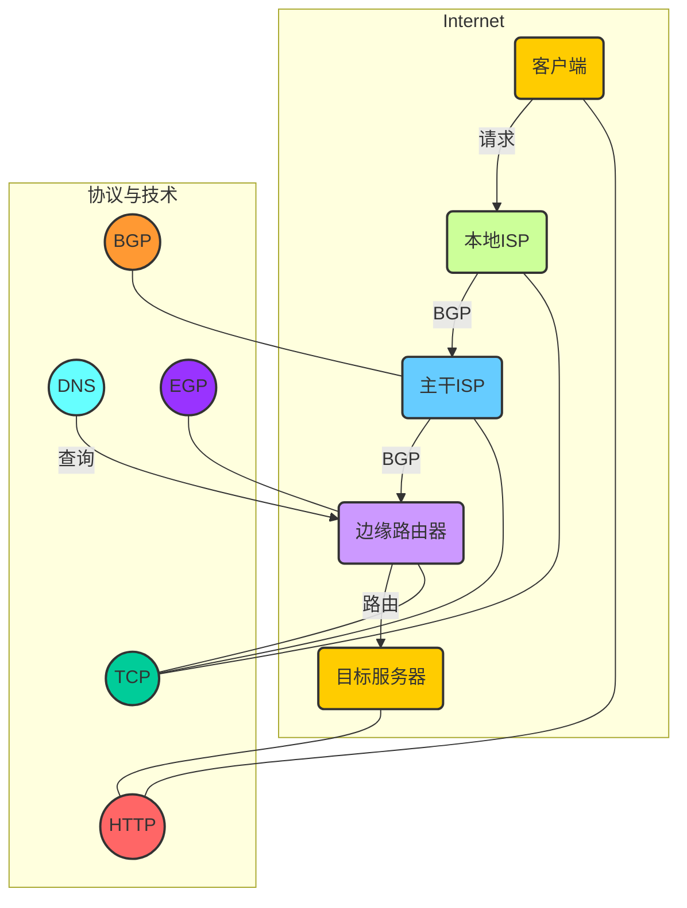
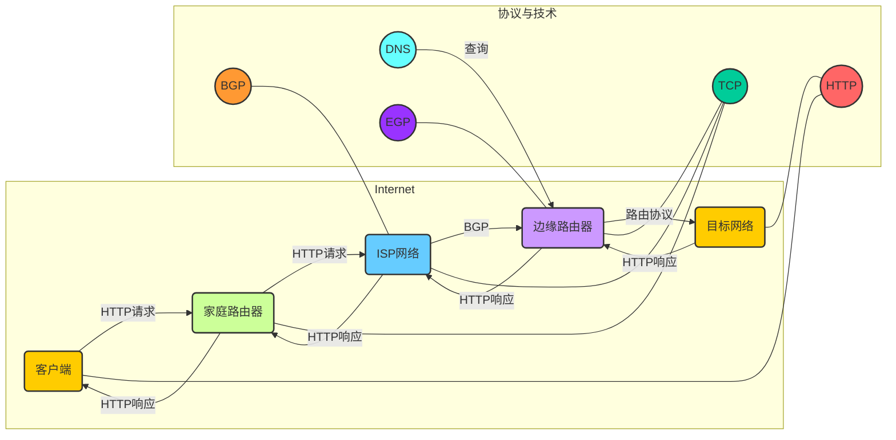

# mermaid

```mermaid
graph TD;
    subgraph Internet
        A(客户端) -->|请求| B(本地ISP);
        B -->|BGP| C(主干ISP);
        C -->|BGP| D(边缘路由器);
        D -->|路由| E(目标服务器);
    end
    
    subgraph 协议与技术
        BGP((BGP));
        TCP((TCP));
        HTTP((HTTP));
        DNS((DNS));
        EGP((EGP));
    end
    
    A --- HTTP;
    B --- TCP;
    C --- TCP;
    D --- TCP;
    E --- HTTP;
    BGP --- C;
    EGP --- D;
    DNS -->|查询| D;
    
    style A fill:#FFCC00,stroke:#333,stroke-width:2px;
    style B fill:#CCFF99,stroke:#333,stroke-width:2px;
    style C fill:#66CCFF,stroke:#333,stroke-width:2px;
    style D fill:#CC99FF,stroke:#333,stroke-width:2px;
    style E fill:#FFCC00,stroke:#333,stroke-width:2px;
    style TCP fill:#00CC99,stroke:#333,stroke-width:2px;
    style HTTP fill:#FF6666,stroke:#333,stroke-width:2px;
    style DNS fill:#66FFFF,stroke:#333,stroke-width:2px;
    style BGP fill:#FF9933,stroke:#333,stroke-width:2px;
    style EGP fill:#9933FF,stroke:#333,stroke-width:2px;

```

```mermaid
graph LR;
    subgraph Internet
        A(客户端) -->|HTTP请求| B(家庭路由器);
        B -->|HTTP请求| C(ISP网络);
        C -->|BGP| D(边缘路由器);
        D -->|路由协议| E(目标网络);
        E -->|HTTP响应| D;
        D -->|HTTP响应| C;
        C -->|HTTP响应| B;
        B -->|HTTP响应| A;
    end
    
    subgraph 协议与技术
        BGP((BGP));
        TCP((TCP));
        HTTP((HTTP));
        DNS((DNS));
        EGP((EGP));
    end
    
    A --- HTTP;
    B --- TCP;
    C --- TCP;
    D --- TCP;
    E --- HTTP;
    BGP --- C;
    EGP --- D;
    DNS -->|查询| D;
    
    style A fill:#FFCC00,stroke:#333,stroke-width:2px;
    style B fill:#CCFF99,stroke:#333,stroke-width:2px;
    style C fill:#66CCFF,stroke:#333,stroke-width:2px;
    style D fill:#CC99FF,stroke:#333,stroke-width:2px;
    style E fill:#FFCC00,stroke:#333,stroke-width:2px;
    style TCP fill:#00CC99,stroke:#333,stroke-width:2px;
    style HTTP fill:#FF6666,stroke:#333,stroke-width:2px;
    style DNS fill:#66FFFF,stroke:#333,stroke-width:2px;
    style BGP fill:#FF9933,stroke:#333,stroke-width:2px;
    style EGP fill:#9933FF,stroke:#333,stroke-width:2px;

```

