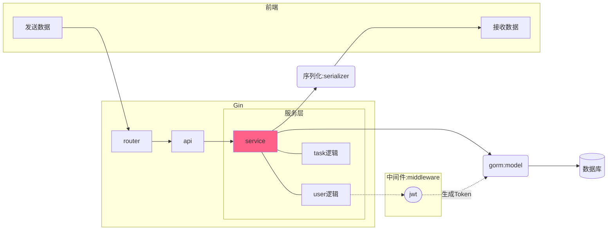

# Todo-List

技术栈
gin + gorm


```tree
Gin-Grom-TodoList/
├── api // api
├── cache
├── conf
├── middleware
├── model
├── pkg
│   ├── err
│   └── utils
├── routes
├── serializer
├── service
└── test
```


项目结构图 

## 加密密码

```go
// 验证密码  
  
func (user *User) CheckPassword(password string) bool {  
   err := bcrypt.CompareHashAndPassword([]byte(user.PasswordDigit), []byte(password))  
   return err == nil  
}  
  
// 加密  
  
func (user *User) SetPassword(password string) error {  
   bytes, err := bcrypt.GenerateFromPassword([]byte(password), 12)  
   if err != nil {  
      return err  
   }  
   user.PasswordDigit = string(bytes)  
   return nil  
}
```


## jwt 处理逻辑

- 用户使用用户名密码来请求服务器
- 服务器进行验证用户的信息
- 服务器通过验证发送给用户一个token
- 客户端存储token，并在每次请求时附送上这个token值
- 服务端验证token值，并返回数据

这个token必须要在每次请求时传递给服务端，它应该保存在请求头里， 另外，服务端要支持`CORS(跨来源资源共享)`策略，一般我们在服务端这么做就可以了`Access-Control-Allow-Origin: *`。


```go
func GenerateToken(id uint, username string, authority int) (string, error) {  
  
   expireTime := time.Now().Add(24 * time.Hour)  // 过期时间
  
   claims := Claims{  
      Id:        id,  
      UserName:  username,  
      Authority: authority,  
      RegisteredClaims: jwt.RegisteredClaims{  
         ExpiresAt: jwt.NewNumericDate(expireTime),  
         Issuer:    "todo_list",  
      },   
    }  
   tokenClaims := jwt.NewWithClaims(jwt.SigningMethodHS256, claims)  
   token, err := tokenClaims.SignedString(JwtSecret)  
   return token, err  
}  
  
// 验证TOKEN  
  
func ParseToken(token string) (*Claims, error) {  
   tokenClaims, err := jwt.ParseWithClaims(token, &Claims{}, func(token *jwt.Token) (interface{}, error) {  
      return JwtSecret, nil  
   })  
   if tokenClaims != nil {  
      if claims, ok := tokenClaims.Claims.(*Claims); ok && tokenClaims.Valid {  
         return claims, nil  
      }  
   }  
   return nil, err  
}
```