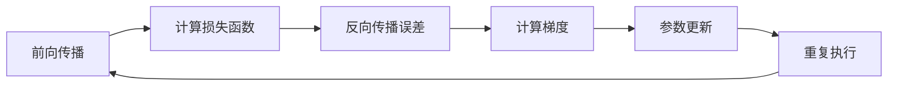

# 卷积神经网络基础


## 卷积神经网络基本结构

1. 输入层（Input Layer）：接受原始图像或其他类型的输入数据。

2. 卷积层（Convolutional Layer）：通过应用卷积操作来提取输入图像的特征。每个卷积层都包含多个卷积核（也称为滤波器），每个卷积核在图像上滑动，执行卷积运算以生成特征图。

3. 激活层（Activation Layer）：对卷积层的输出应用非线性激活函数（例如ReLU），以引入非线性特征并增强网络的表达能力。

4. 池化层（Pooling Layer）：通过减少特征图的空间维度来降低计算量，同时保留重要的特征。常见的池化操作包括最大池化和平均池化。

5. 全连接层（Fully Connected Layer）：将前面的层的输出展平并连接到一个全连接层，每个神经元与上一层的所有神经元相连。全连接层用于学习输入特征之间的复杂关系，并生成最终的分类结果。
 
6. 输出层（Output Layer）：根据任务的需求选择适当的激活函数（如softmax）来生成网络的输出，如分类结果或回归预测。


## 反向传播





*利用反向传播计算线性回归*

```python
import numpy as np

# 准备数据
X = np.array([[1], [2], [3], [4], [5]])  # 自变量
y = np.array([2, 4, 6, 8, 10])  # 因变量

# 初始化权重和偏置
w = np.random.randn(1)
b = np.random.randn(1)

# 设置学习率和迭代次数
learning_rate = 0.01
num_iterations = 1000

# 反向传播算法
for i in range(num_iterations):
    # 前向传播
    y_pred = X * w + b
    
    # 计算损失
    loss = np.mean((y_pred - y) ** 2) # 均方误差
    
    # 计算梯度
    dw = np.mean(2 * (y_pred - y) * X) # 将差异乘以 2 是为了简化计算导数的过程
    db = np.mean(2 * (y_pred - y))
    
    # 更新权重和偏置
    w -= learning_rate * dw
    b -= learning_rate * db

# 进行预测
print(w)
print(b)
print("预测结果:", y_pred)

```


## 全连接层

one-hot 编码


## 卷积层

- 卷积核的channel与特征卷积层的channel相同
- 输出的特征矩阵channel与卷积核个数相同

***

经过卷积后的矩阵尺寸大小计算公式为：

$$
N = (W-F+2P)/S + 1
$$
1. 输入图片的大小 $W \times W$
2. Filter大小 $F \times F$
3. 步长 $S$
4. padding的像素数 $P$

输出尺寸 = (输入尺寸 - 卷积核尺寸 + 2 * 填充大小) / 步长 + 1


**sigmoid激活函数**

作用是引入非线性变换，增加神经网络的表达能力。

$$
f(x) = \frac{1}{1+e^{-x}}
$$
网络层数较深时，易出现梯度消失


**Relu激活函数**

$$
f(x) = Max(0,x)
$$

1. **Dying ReLU问题**：当神经元的输入值为负数时，ReLU 函数的输出为零，导致神经元失活。在训练过程中，如果一旦某个神经元的权重被更新到使其输出为负数，那么该神经元在后续的训练过程中将不再激活，导致该神经元永远不会学习。这种情况称为 "Dying ReLU"，影响了网络的表达能力。
    
2. **输出不是零中心**：ReLU 的输出范围在正半轴，即 [0, +∞)，因此其均值不为零。这导致了一些问题，比如在网络层叠加时，可能会导致梯度爆炸或消失。
    
3. **不适合处理负数输入**：ReLU 在输入为负数时输出为零，这可能不适合某些情况。比如在某些回归任务中，输出需要包含负数值，但 ReLU 函数无法直接处理这些情况。
    
4. **导致梯度消失**：虽然 ReLU 可以解决梯度消失问题，但它仍然可能导致梯度消失。在训练过程中，某些神经元可能会永远保持非活跃状态，导致它们的权重始终不会被更新，从而造成梯度消失问题。
    
5. **不是平滑函数**：ReLU 在零点处不可导，这在某些优化算法中可能会导致问题。


## 池化层

目的：对特征如进行稀疏处理，减少数据运算量

**MaxPooling下采样**

**AveragePooling下采样**


pythorch Tensor的通道排序\[batch, channel, height, width\]