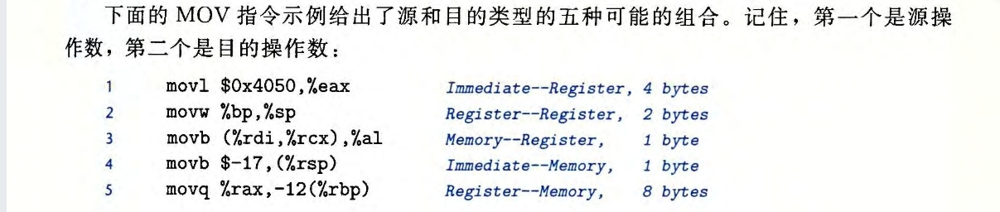
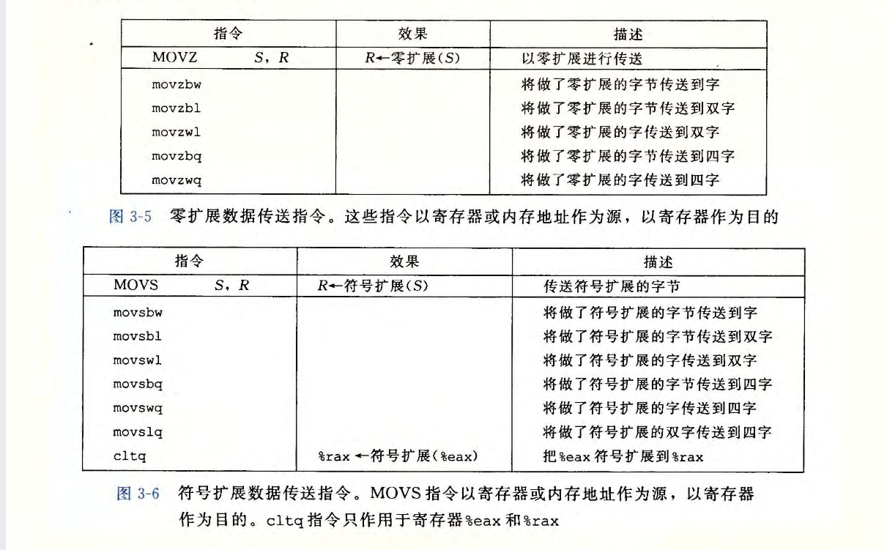
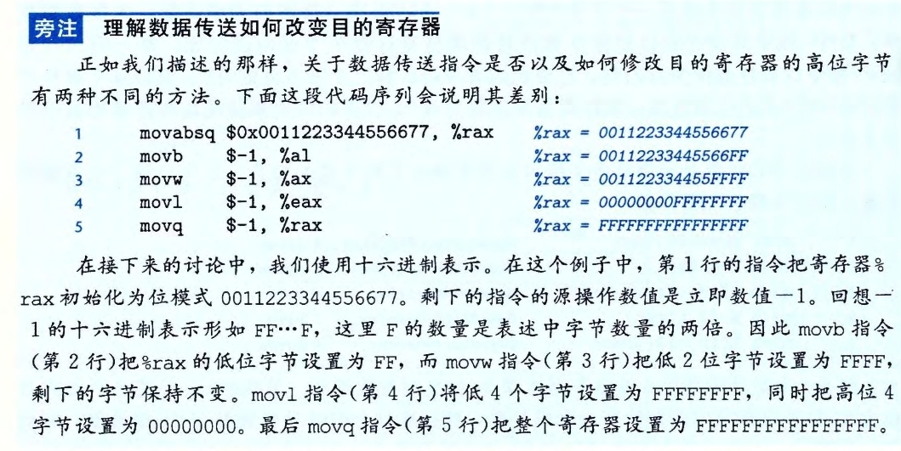
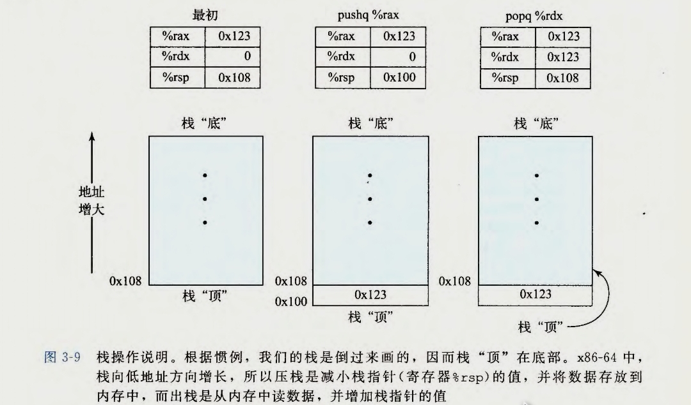
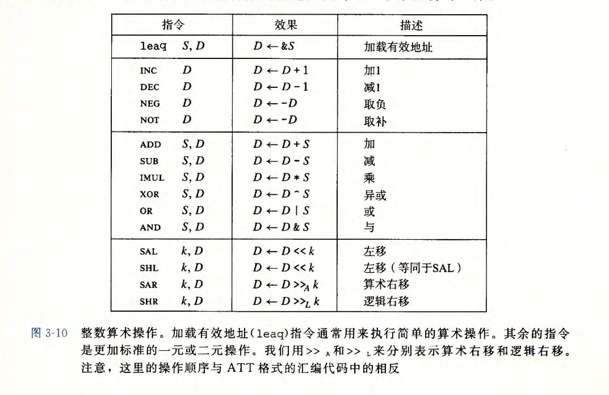
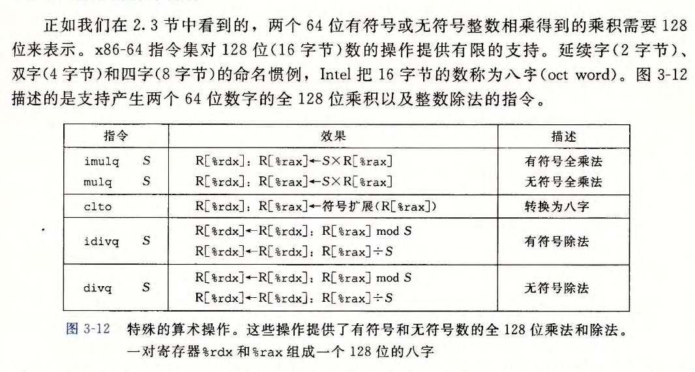

# 程序的机器级表示

- 程序计数器 - PC
- 整数寄存器
- 条件码寄存器
- 一组向量寄存器

## 汇编指令

此处寄存器讨论的都是整数

## 大小

![[Picture/capture-2023-02-25-10-33-05.jpg]]

movb 传送字节 
movw 传送字
movl 传送双字
movq 传送四字

![[Picture/capture-2023-02-25-10-38-18.jpg]]

### 访问

当这些指令以寄存器作为目标时，对于生成小于 8 字节结果的指令，寄存器中剩下的字节会怎么样，对此有两条规则：
- 生成 1 字节和 2 字节数字的指令会保持剩下的==字节不变==；
- 生成 4 字节数字的指令会把==高位 4 个字节置为 0==。

大多数指令有一个或多个操作数，操作数的类型有：
1. 立即数 （常数值）
	-  立即数的书写方式为：$ + num 如：$-577、$0x1f
2. 寄存器  （寄存器中的内容）
3. 内存引用 （根据计算出来的地址访问内存位置）

有多种寻址模式，其中$Imm(r_b, r_i, s)$ 表示的是最为常用的模式。

这样的引用分为4个部分：
立即数偏移$Imm$，一个基址寄存器$r_b$，一个变址寄存器$r_i$和一个比例因子$s$，这里$s$必须是1、2、4或者8。
基址和变址寄存器都必须是 64 位寄存器。
有效地址被计算为$Imm+R[r_b]+R[r_i]+s$。其他形式都是该通用形式的特殊情况。

![[Picture/Screenshot_20230225_110118.jpg]]


#### 数据传送指令

movabsq 处理64位数据 并且只能以寄存器作为目的

MOV  S, D  
效果: D <-- S



MOVZ 会将*目的*中的剩余字节填充为0
MOVS 会通过符号位拓展来填充。将*源*操作的最高位进行复制






example: mov (%rdi), %rax
(%rdi) 访问寄存器所指向的空间
%rdi    访问寄存器

#### 栈操作

栈的操作：
```
pushq S
popq  D
```
栈指针 **%rsp** 保存着栈顶元素的地址

因此`pushq %rbq` 等价于
```
subq $8, %rsp
movq %rbq,(%rsp)
```
区别是 pushq 指令编码为1个字节，而这两行指令一共需要8字节



`popq %rax`等价于
```
movq (%rsp),%rax
addq $8, %rsp
```

### 算数和逻辑操作



这些操作分为四组：加载有效地址、一元操作、二元操作和移位。

#### 加载有效地址

leaq 实际上是movq的变形，指令形式是从内存读数据到寄存器
>(xxx，xxx)并非取地址
>该指令并不是从指定的位置读入数据，而是将==有效地址==写人到目的操作数。

如果寄存器%rdx的值为x，那么指令`leaq 7(%rdx, %rdx, 4), %rax`，将会设置寄存器%rax 的值为 5x+7

leaq指令能执行加法和有限形式的乘法，适合简单的算数表达式


#### 一元和二元操作

图中第二组的操作是一元操作，既是源又是目的。该操作数可以说一个寄存器，也可以是内存位置。
incq(%rsp)会使栈顶的8字节元素+1，类似于 ++

图中第三组是二元操作，第二个操作数 既是源又是目的。所以这类似于 += 
但需要注意源操作数是第一个，目的操作数是第二个
第一个操作数可以是立即数，但第二个不可以。
`subq %rax, %rdx` 使寄存器%rdx的值减去%rax 中的值, 即%rdx-=%rax

#### 移位操作

最后一组是移位操作。首先给出移位量，然后是要移位的数。
移位量可以是一个立即数，或者放在单字节寄存器%cl 中(这些指令只能使用这个寄存器)

>[!info]
> 算术移位会填上符号位，而逻辑移位只填上0
> 因此只有右移存在这种区分

#### 特殊的算术操作



imulq == 补码乘法

>CSAPP P134:
>如何实现64位 * 64位 = 128 位

### 控制

#### 条件码
常用的条件码有
CF：进位标志。最近的操作使最高位产生了进位。可用来检查无符号操作的溢出 
ZF：零标志。最近的操作得出的结果为 0 。
SF：符号标志。最近的操作得到的结果为负数。
OF：溢出标志。最近的操作导致一个补码溢出——正溢出或负溢出。
leaq不会改变任何条件码，因为leaq是用于地址计算。
但[[Picture/Screenshot_20230225_145404.jpg]]中的所有指令都会设置条件码。

![[Picture/Screenshot_20230225_161630.jpg]]
除了之前图片展示的指令会设置条件码，上图中的指令也会展示条件码。

#### 访问条件码

条件码通常不会直接读取，常用的使用方法有三种：
1. 根据条件码的某种组合，将某个字节设置为0或1。
2. 条件跳转到程序的其他的部分。
3. 有条件地传送数据。

##### set指令
set指令的后缀并不表示字节大小，而是表示不同的条件
setl set less
setb set below 

![[Picture/Screenshot_20230225_162621.jpg]]

```
cmpq %rsi, %rdi
setl %al
```

#### 跳转指令

jmp指令通常需要一个标号(label)指明。
jmp指令是无条件跳转。
它可以是直接跳转，即跳转目标是作为指令的一部分编码的；
也可以是间接跳转，即跳转目标是从寄存器或内存位置中读出的。
`jmp *%rax`   用寄存器%rax中的值作为跳转目标。
`jmp *(%rax)` 用寄存器%rax中的值作为读地址，从内存中读出跳转目标。

![[Picture/Screenshot_20230225_163920.jpg]]

#### 跳转指令的编码
CSAPP P140

跳转的方法
1. 给出PC-relative，地址偏移量1、2、4字节
2. 给出绝对地址，地址偏移量4字节


#### 用条件控制来实现条件分支

实现条件操作的传统方法是使用*控制*的条件转移，当条件满足时，程序沿着这条执行路径执行，如果条件不满足，就执行另一条路径。

使用*数据*的条件转移，这种方法先计算一个条件操作的两个结果，再根据条件是否满足从中选择一个。只有再一些受限制的情况中，这种策略才可行。但如果可行，就可以用简单的一条条件传送指令实现它。而条件传送指令更加符合现代处理器的性能特性。


==**基于条件数据传送的代码会比基于条件控制转移的代码性能要好，因为处理器通过使用流水线来获得高性能**==


为了理解为什么基于条件数据传送的代码会比基于条件控制转移的代码（如图3-16中那样）性能要好，我们必须了解一些关于现代处理器如何运行的知识。
正如我们将在第4章和第5章中看到的，处理器通过使用流水线 (pipelining) 来获得高性能，在流水线中，一条指令的处理要经过一系列的阶段，每个阶段执行所需操作的一小部分（例如，从内存取指令、确定指令类型、从内存读数据、执行算术运算、向内存写数据，以及更新程序计数器）。
这种方法通过重叠连续指令的步骤来获得高性能，
例如，在取一条指令的同时，执行它前面一条指令的算术运算。要做到这一点，要求能够事先确定要执行的指令序列，这样才能保持流水线中充满了待执行的指令 。当机器遇到条件跳转（也称为“分支")时，只有当分支条件求值完成之后，才能决定分支往哪边走。
处理器采用非常精密的**分支预测**逻辑来猜测每条跳转指令是否会执行 。只要它的猜测还比较可靠（现代微处理器设计试图达到90% 以上的成功率），指令流水线中就会充满着指令。另一方面，错误预测一个跳转，要求处理器丢掉它为该跳转指令后所有指令己做的工作，然后再开始用从正确位置处起始的指令去填充流水线。正如我们会看到的，这样一个错误预测会招致很严重的惩罚，浪费大约 15~30 个时钟周期，导致程序性能严重下降。


##### 条件传送指令


并非所有的*条件传送*表达式都可以用条件传送来编译。使用条件传送也不总是会提高代码的效率。比如运算分支结果可能耗费大量时间。但最后并不需要这条分支。而编译器也很少使用条件传送，除非计算简单。

总的来说，条件数据传送提供了一种用*条件控制转移*来实现条件操作的替代策略。它们只能用于非常受限制的情况，但是这些情况还是相当常见的，而且与现代处理器的运行方式更契合。

#### 循环


for：
p157


##### switch 语句

通过使用跳转表(jump table)，使得跳转更加高效。


### 过程

#### 运行时栈

#### 转移控制