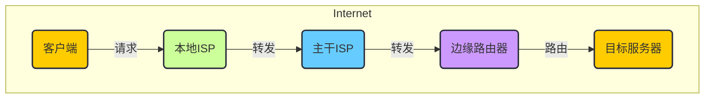

# 概论

## 1.什么是Internet

网络的基本组成：节点和边。
Internet（因特网）实际上是“网络的网络”，是由一堆网络通过网络互联设备连接起来的巨型网络

Internet的基本组成：节点、边和协议
以TCP协议和IP协议为主的一簇协议支撑工作的网便是互联网(Internet)。

- 节点
    - 主机结点：主机`host` = 端系统`end system`。以及运行的网络应用程序。样式为 `□` 方形
    - 交换节点：样式为 ○ 圆形
        - 交换机：在链路层
        - 路由器：在网络层

- 边
    - 通信链路：以vp/s作为单位
        - 接入链路：主机连接到互联网的链路，即 `□——○`
        - 主干链路：路由器间的链路，即 `○——○`

- 协议：对等层的实体*通信过程中遵守的的规范*
    - 以TCP协议和IP协议为主的一簇协议支撑工作的网便是互联网(Internet)。

IETF

## 2.网络边缘

## 3.网络核心

## 4.接入网和物理媒体

## 5.Internet结构和IPS

## 6.分组延时、丢失和吞吐量

## 7.协议层次和服务模型

