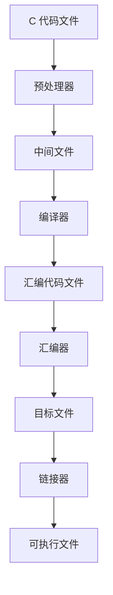

# C的编译





链接过程是将一个或多个目标文件（包含机器代码和数据）组合在一起，形成可执行程序的过程。链接过程通常分为以下几个步骤：

1. 预处理（Preprocessing）：在进行实际的编译和链接之前，预处理器会对源代码文件进行处理。这包括展开宏定义、包含头文件等操作。预处理器生成经过处理的源代码文件。

2. 编译（Compilation）：编译器将预处理后的源代码文件翻译成汇编语言或机器语言的目标文件。编译器对每个源代码文件进行词法分析、语法分析、语义分析和优化等步骤，最终生成相应的目标文件。

3. 汇编（Assembly）：汇编器将编译生成的目标文件转换成可执行文件中使用的机器指令。汇编器将每条汇编语句转换为对应的机器语言指令，并生成与目标硬件体系结构兼容的机器代码文件。

4. 链接（Linking）：链接器将多个目标文件以及可能需要的库文件（例如动态链接库）组合在一起，解决各个目标文件之间的符号引用关系，生成最终的可执行程序或共享库。链接器的主要任务包括符号解析、符号重定位和地址空间分配等。

在链接过程中，符号解析是一个重要的步骤。当一个目标文件引用了其他目标文件中定义的符号（如函数或全局变量）时，链接器需要解析这些符号的引用，找到其定义所在的目标文件或库文件，并进行连接。

链接可以分为静态链接和动态链接两种方式：

- 静态链接（Static Linking）：在静态链接中，链接器将所有被引用的目标文件和库文件的代码和数据复制到最终的可执行程序中。可执行程序独立于系统上的库文件运行，但会增加可执行文件的大小。

- 动态链接（Dynamic Linking）：在动态链接中，链接器仅将对库文件的引用信息记录在可执行文件中，而不将实际的代码和数据复制到可执行文件中。在程序运行时，操作系统的动态链接器将在内存中加载所需的库文件，并将其与程序进行链接。动态链接可以减小可执行文件的大小，但依赖于系统中存在相应的共享库。

总之，链接过程将编译生成的目标文件组合在一起，解决符号引用关系，生成可执行程序或共享库，使程序能够在计算机上运行。


## 多文件编译


假设你有两个源文件：`main.c` 和 `functions.c`，以及一个头文件 `functions.h`。

1.  `main.c` 是程序的入口文件，包含 `main` 函数。

```c
// main.c

#include <stdio.h>
#include "functions.h"

int main() {
    int a = 5;
    int b = 10;
    int result = add(a, b);
    printf("The result is: %d\n", result);
    return 0;
}
```

2. `functions.c` 包含了自定义的函数实现。

```c
// functions.c

int add(int a, int b) {
    return a + b;
}
```

3. `functions.h` 定义了函数的声明。
```c
// functions.h

int add(int a, int b);
```

使用多文件编译的步骤如下：

1. 将上述三个文件保存到同一个目录下。

2. 打开命令行终端，并进入该目录。

3. 使用以下命令编译 `main.c` 和 `functions.c` 文件：

```bash
gcc -o program main.c functions.c
```

这将生成一个名为 `program` 的可执行文件。

4. 运行可执行文件：
```bash
./program
```

