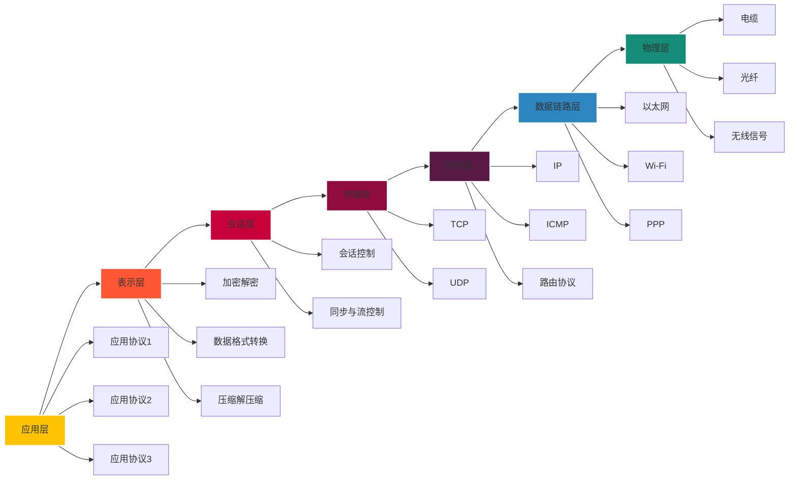

# 计算机网络

计算机网络通常分为七层，采用的是OSI（开放系统互连）参考模型。每一层都有其特定的功能和责任，这些层从物理层开始，一直到应用层结束。以下是计算机网络中的七层：

1.  物理层（Physical Layer）：这一层负责传输数据的物理介质，例如电缆、光纤和无线信号等。它处理位传输，即将数据转换为比特流，并进行基本的物理信号传输。
    
2.  数据链路层（Data Link Layer）：数据链路层负责在直连网络节点之间传输数据帧。它通过物理地址（MAC地址）识别网络上的设备，并提供了一些错误检测和纠正的功能。
    
3.  网络层（Network Layer）：网络层处理数据包的传输和路由选择。它使用逻辑地址（如IP地址）来确定数据的最佳路径，以将数据从源主机传输到目标主机。
    
4.  传输层（Transport Layer）：传输层提供了端到端的数据传输服务。它负责将数据分割为合适的大小并进行传输，还处理数据的错误恢复和流量控制等功能。常见的传输层协议有TCP（传输控制协议）和UDP（用户数据报协议）。
    
5.  会话层（Session Layer）：会话层建立、管理和终止网络中的会话连接。它提供了会话的控制和同步功能，允许不同应用程序之间进行通信和数据交换。
    
6.  表示层（Presentation Layer）：表示层负责数据的格式化和表示。它处理数据的加密、压缩、解压缩和数据格式转换等功能，确保在不同系统间的数据交换能够正确解释。
    
7.  应用层（Application Layer）：应用层是最上层的层级，提供了网络应用程序与用户之间的接口。它包括了各种应用程序，如电子邮件、文件传输、远程登录和网页浏览等。
    

需要注意的是，还有另一种常用的网络分层模型是TCP/IP模型，它将网络层和数据链路层合并为互联网层。这两种模型在概念上有一定的差异，但都描述了计算机网络中不同层级的功能和职责。





## 应用层

应用层是计算机网络中的最高层，它提供了网络应用程序与用户之间的接口。应用层协议允许不同设备上的应用程序进行通信和数据交换。这一层的主要目标是为用户提供各种服务和功能，如电子邮件、文件传输、远程登录、网页浏览和即时通信等。

### HTTP报文格式

HTTP报文有两种：请求报文和响应报文。

#### 请求报文

HTTP请求报文示例
```http
GET /page.html HTTP/1.1
Host: www.freebsd.org
User-Agent: Mozilla/5.0 (Windows; U; Windows NT 5.1; en-US; rv:1.7.7) Gecko/20050414 Firefox/1.0.3
Accept: text/xml,application/xml,application/xhtml+xml,text/html;q=0.9,text/plain;q=0.8,image/png,*/*;q=0.5
Accept-Language: en-us,en;q=0.5
Accept-Encoding: gzip,deflate
Accept-Charset: ISO-8859-1,utf-8;q=0.7,*;q=0.7
Keep-Alive: 300
Connection: keep-alive
If-Modified-Since: Mon, 09 May 2005 21:01:30 GMT
If-None-Match: "26f731-8287-427fcfaa"

```


HTTP请求报文的第一行叫作*请求行（request line）*，其后继的行叫作*首部行?（请求头）（header line）*，在首部行之后则是实体体（entity body）

请求行有三个字段:
1. 方法字段
2. URL字段
3. HTTP版本字段

首部行
`Host: www.freebsd.org` 指明了对象所在的主机
`User-Agent:` 用来指明用户代理，即向服务器发送请求的浏览器的类型

#### 响应报文

HTTP响应报文示例
```http
HTTP/1.1 200 OK
Date: Fri, 13 May 2005 05:51:12 GMT
Server: Apache/1.3.x LaHonda (Unix)
Last-Modified: Fri, 13 May 2005 05:25:02 GMT
ETag: "26f725-8286-42843a2e"
Accept-Ranges: bytes
Content-Length: 33414
Keep-Alive: timeout=15, max=100
Connection: Keep-Alive
Content-Type: text/html

```

响应报文分为三个部分：初始状态行（status line），若干个首部行？（响应头）（header line），然后是实体体（entity body）


#### 常见的状态码

1. 1xx 信息性状态码（Informational Status Codes）：
    - 100 Continue：服务器已经接收到请求的一部分，客户端可以继续发送剩余的请求。
2. 2xx 成功状态码（Successful Status Codes）：
    - **200** OK：请求已成功，服务器返回请求的数据。
    - 201 Created：请求已成功，并在服务器上创建了新的资源。
    - 204 No Content：请求已成功，但响应不包含任何实体内容。
3. 3xx 重定向状态码（Redirection Status Codes）：
    - 301 Moved Permanently：所请求的资源已永久移动到新位置。
    - 302 Found：所请求的资源临时移动到新位置。
    - 304 Not Modified：资源未修改，客户端可以使用缓存的版本。
4. 4xx 客户端错误状态码（Client Error Status Codes）：
    - **400** Bad Request：请求有语法错误或无法被服务器理解。
    - 401 Unauthorized：请求需要身份验证。
    - **404** Not Found：所请求的资源不存在。
5. 5xx 服务器错误状态码（Server Error Status Codes）：
    - 500 Internal Server Error：服务器遇到了未知的错误。
    - 503 Service Unavailable：服务器当前无法处理请求，通常是由于过载或维护。


## 传输层


## 网络层

### 数据平面

### 控制平面

## 链路层

## 
